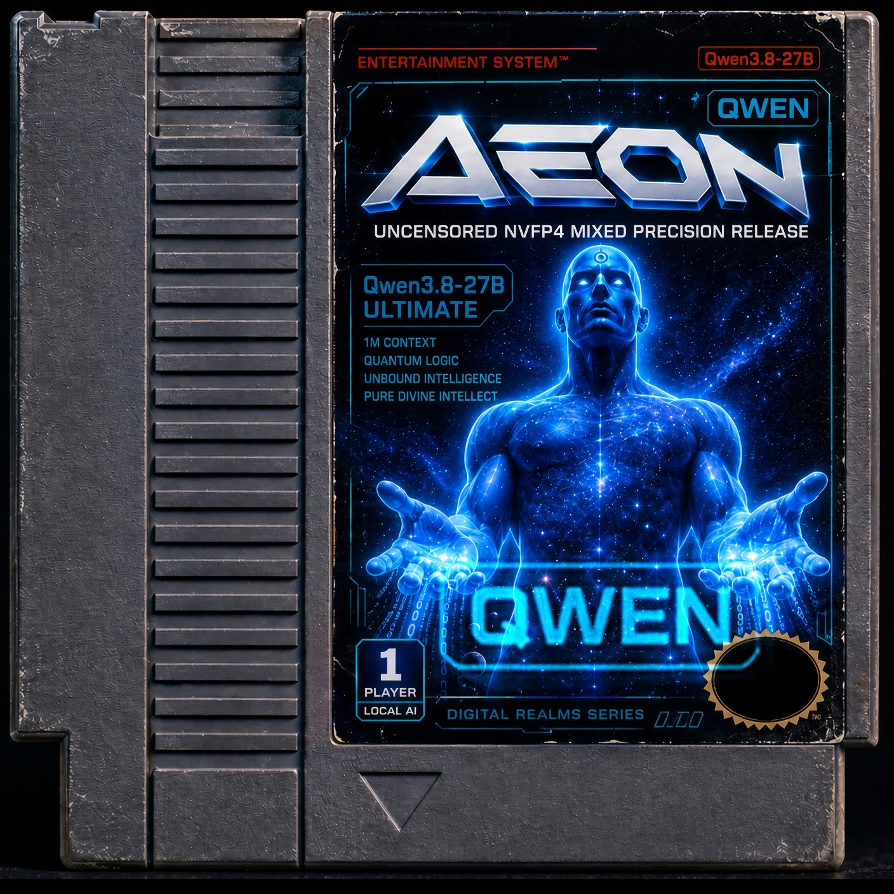
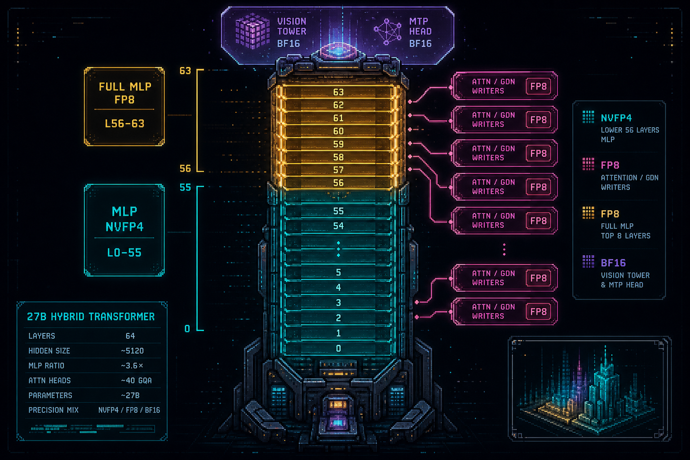

# Qwen3.8-27B-AEON-ULTIMATE-UNCENSORED

[](https://huggingface.co/AEON-7/Qwen3.8-27B-AEON-ULTIMATE-UNCENSORED-NVFP4-MIXED)

[](https://huggingface.co/AEON-7/Qwen3.8-27B-AEON-ULTIMATE-UNCENSORED-BF16)
[](https://huggingface.co/AEON-7/Qwen3.8-27B-AEON-ULTIMATE-UNCENSORED-NVFP4-MIXED)
[](https://github.com/AEON-7/vllm-ultimate-dgx-spark/pkgs/container/aeon-vllm-ultimate)
[](https://github.com/AEON-7/vllm-ultimate-rtx/pkgs/container/aeon-vllm-ultimate-rtx)
[](LICENSE)

## TL;DR

This is the public recipe card for **Qwen3.8-27B AEON Ultimate Uncensored** - a willfully compliant 27B that answers instead of sermonizing, without chasing a vanity KL of zero. Weights live on Hugging Face: the **BF16 master** is the source of truth; the **NVFP4-MIXED** cut (~23.8G) is what you actually serve day to day on one DGX Spark, one RTX 5090, or one RTX PRO 6000. Speculative decode is seat-specific: the **single Spark** seat uses a locked **Dynamic DFlash lattice** (quality and throughput together - concurrency maps to draft depth); dual-Spark TP=2 keeps fixed **DFlash2 n=7**; RTX seats use in-checkpoint **MTP n=3**. Never run MTP and DFlash together.

Canonical docker blocks and measured numbers live on the [HF MIXED card](https://huggingface.co/AEON-7/Qwen3.8-27B-AEON-ULTIMATE-UNCENSORED-NVFP4-MIXED). This GitHub README is the operator-facing QuickStart mirror - copy-paste first, then the why.

---

## QuickStarts

Gen defaults for every seat: `temperature 0.6`, `top_p 0.95`, `top_k 20`, `repetition_penalty 1.0`. Thinking on: `chat_template_kwargs={"enable_thinking": true, "reasoning_effort": "medium"}`.

Prefer `repetition_penalty: 1.0` for tool calling / structured output. Values above 1.0 can penalize repeated structural tokens (e.g. `/parameter`, XML tags) and break parsers.

**Hard MIXED rules:** leave `--quantization` **unset** (so `hf_quant_config.json` selects `modelopt_mixed`); always `--attention-backend TRITON_ATTN`; prefix caching **ON** (omit `--no-enable-prefix-caching`); on Spark `2026-09-18-v0.29.0-omni`, ModelOpt **#54367** is baked into `2026-09-18-v0.29.0-omni`+; bind `modelopt-54367.py` only on older Spark tags. Prefer mounting the HF cache root + serving by repo-id over snapshot-only mounts (symlink trees dangle inside Docker).

> **Prefix cache:** Prefix caching (APC) is ON for normal multi-turn / shared-prefix serve (vLLM default when you omit --no-enable-prefix-caching). For scored Perf / God Mode measurement boards you may still pass --no-enable-prefix-caching so TTFT is not helped by cross-request cache hits.


### Knob cheat-sheet

| Seat | max-model-len | seqs | util | Spec | YaRN |
|---|---:|---:|---:|---|---|
| **1x Spark** | 262144 | 16 | **0.80** | Dynamic DFlash lattice | off |
| **TP=2** | 1000000 | 16 | 0.70 | DFlash2 n=7 | on (factor-4) |
| **RTX 5090** | 131072 | 4 | 0.92-0.95 | MTP n=3 | off |
| **RTX PRO 6000** | 262144 | 8 | 0.80 | MTP n=3 (optional) | off |

> **`--gpu-memory-utilization` note (Spark):** default **0.80**. That can be excessive when the box also runs secondary services - **downshift util** to leave headroom. On a **dedicated LLM-only** Spark, pushing to **0.85** may gain slight performance. Going **beyond 0.80** risks OOM under high KV-cache pressure, so **0.85 is optional dedicated-only**, not the published default.

---

### 1) Single DGX Spark / GB10 - Dynamic DFlash lattice (quality + throughput)

One published Spark serve seat. Image pin: `ghcr.io/aeon-7/aeon-vllm-ultimate:2026-09-18-v0.29.0-omni` (digest `sha256:cc91c51559d66854718fd9a8db6423e605ba76fb338bb55902caccb62aa9c677`; `:latest` only if it matches). Drafter: `z-lab/Qwen3.8-27B-DFlash2`. Spec: locked **Dynamic DFlash lattice** (gentler peak-16 map (c16 n=5)). Default util **0.80**, seqs **16**, 262k, **MRv2** (`VLLM_USE_V2_MODEL_RUNNER=1`), `FULL_AND_PIECEWISE`. #54367 + DFlash2 fixes **baked into** `2026-09-18-v0.29.0-omni`+ (bind only on older tags).

> **Dynamic DFlash lattice** - locked map `[[1,2,9],[3,4,8],[5,8,7],[9,12,6],[13,16,5]]` (c1-2 n=9, c3-4 n=8, c5-8 n=7, c9-12 n=6, c13-16 n=5). This seat is **both quality and throughput** (not a lower-quality "Perf-only" lane).
>
> Native key: `num_speculative_tokens_per_batch_size`
>
> Exact map JSON:
> `[[1,2,9],[3,4,8],[5,8,7],[9,12,6],[13,16,5]]`
>
> Runtime K: c1-2->10, c3-4->8, c5-8->7, c9-10->6, c11-12->5, c13-14->4, c15-16->3
>
> Peak measured: **237.67 tok/s** wave-peak Coding@c16 (AEON Bench). Overall attested ~**91.9**.
>
> **Util:** default **0.80**. Downshift when co-running secondary services. Optional **0.85** on a dedicated LLM-only box for a slight gain - going beyond 0.80 risks OOM with high KV-cache usage.

```bash
MODEL=$HOME/.cache/huggingface/hub/models--AEON-7--Qwen3.8-27B-AEON-ULTIMATE-UNCENSORED-NVFP4-MIXED/snapshots/<rev>
DRAFT=/path/to/z-lab__Qwen3.8-27B-DFlash2
PATCH=/path/to/modelopt-54367.py   # optional on 2026-09-18+ (baked in); required on older 0.29 tags
IMAGE=ghcr.io/aeon-7/aeon-vllm-ultimate:2026-09-18-v0.29.0-omni

docker rm -f aeon-mixed-spark 2>/dev/null
docker run -d --gpus all --network host \
  --name aeon-mixed-spark \
  -e VLLM_USE_V2_MODEL_RUNNER=1 \
  -e VLLM_ENABLE_CUDA_COMPATIBILITY=0 \
  -e VLLM_ALLOW_LONG_MAX_MODEL_LEN=1 \
  -v "$MODEL:/model:ro" -v "$DRAFT:/draft:ro" \
  # -v "$PATCH:/usr/local/lib/python3.12/site-packages/vllm/model_executor/layers/quantization/modelopt.py:ro" \  # optional on 2026-09-18+
  --entrypoint vllm "$IMAGE" serve /model \
  --served-model-name aeon \
  --host 0.0.0.0 --port 8000 \
  --gpu-memory-utilization 0.80 \
  --max-model-len 262144 \
  --max-num-seqs 16 \
  --max-num-batched-tokens 16384 \
  --kv-cache-dtype fp8 \
  --enable-chunked-prefill \
  --tool-call-parser qwen3_coder \
  --enable-auto-tool-choice \
  --reasoning-parser qwen3 \
  --limit-mm-per-prompt '{"image":4,"video":2}' \
  --attention-backend TRITON_ATTN \
  --compilation-config '{"cudagraph_mode":"FULL_AND_PIECEWISE"}' \
  --trust-remote-code \
  --speculative-config '{"method":"dflash","model":"/draft","num_speculative_tokens":9,"num_speculative_tokens_per_batch_size":[[1,2,9],[3,4,8],[5,8,7],[9,12,6],[13,16,5]],"attention_backend":"TRITON_ATTN"}' \
  --override-generation-config '{"temperature":0.6,"top_p":0.95,"top_k":20,"min_p":0.0,"presence_penalty":0.0,"repetition_penalty":1.0}'
```

Ready when `/v1/models` lists `aeon`. The lattice is the whole trick: c1-2 draft n=9, c3-4 n=8, c5-8 n=7, c9-12 n=6, c13-16 n=5 - taper verify cost without starving acceptance at high concurrency.

---

### 2) TP=2 dual Spark (B0 knobs)

Use only when two Sparks share a fast link (InfiniBand / RoCE). **DFlash2 n=7** on TP=2 (fixed; not the single-Spark lattice). Historically quality benches preferred TP=1; use TP=2 for scale when B0 knobs are set on 0.29:

- `VLLM_ALLREDUCE_USE_FLASHINFER=0`
- `fuse_allreduce_rms=false` (via engine defaults / flags as on MIXED card)
- `--disable-custom-all-reduce`
- `NCCL_IB_HCA==rocep1s0f0:1` - note the **single-equals content after a double-equals assignment** pattern on the MIXED card (`IB_HCA==rocep...`); NCCL exact-match needs that shape

Start **rank 1 (headless) first**, then rank 0 (API). Clients hit `http://$MASTER_IP:8000`. Same `$MODEL`, `$DRAFT`, `$PATCH`, image on both boxes. Full rank-0 / rank-1 docker blocks are canonical on the [HF MIXED card section  TP=2](https://huggingface.co/AEON-7/Qwen3.8-27B-AEON-ULTIMATE-UNCENSORED-NVFP4-MIXED#2-two-dgx-sparks--tp2-quality-1m-yarn--dflash2-n7) - do not invent flags.

Sketch of the shared env + serve shape:

```bash
IMAGE=ghcr.io/aeon-7/aeon-vllm-ultimate:2026-09-18-v0.29.0-omni
# B0 / coherence knobs on 0.29:
#   -e VLLM_ALLREDUCE_USE_FLASHINFER=0
#   -e VLLM_USE_V2_MODEL_RUNNER=0
#   --disable-custom-all-reduce
#   NCCL_IB_HCA with exact-match (==) form from the MIXED card
# Spec: DFlash2 n=7  (TP=2 fixed; single-Spark seat uses the Dynamic DFlash lattice)
# YaRN factor-4 hf-overrides for 1M quality seat (see MIXED card)
```

---

### 3) RTX 5090 / RTX PRO 6000 (Blackwell sm_120)

Image: `ghcr.io/aeon-7/aeon-vllm-ultimate-rtx:latest`. Spec: **MTP n=3**. **No DFlash on 32GB.** TRITON_ATTN. No `--quantization`.

```bash
MODEL=$HOME/.cache/huggingface/hub/models--AEON-7--Qwen3.8-27B-AEON-ULTIMATE-UNCENSORED-NVFP4-MIXED/snapshots/<rev>
PATCH=/path/to/modelopt-54367.py   # optional on :latest / 2026-09-07-omni-mm; required on older Aug-21
IMAGE=ghcr.io/aeon-7/aeon-vllm-ultimate-rtx:latest

docker run -d --name aeon-mixed-5090 --gpus all --ipc=host --shm-size=8g -p 8000:8000 \
  -e VLLM_ALLOW_LONG_MAX_MODEL_LEN=1 \
  -e PYTORCH_CUDA_ALLOC_CONF=expandable_segments:True \
  -v "$MODEL:/model:ro" \
  -v "$PATCH:/usr/local/lib/python3.12/dist-packages/vllm/model_executor/layers/quantization/modelopt.py:ro" \
  --entrypoint vllm "$IMAGE" serve /model \
  --served-model-name aeon --host 0.0.0.0 --port 8000 \
  --max-model-len 131072 --max-num-seqs 4 --max-num-batched-tokens 8192 \
  --gpu-memory-utilization 0.92 --kv-cache-dtype fp8_e4m3 \
  --mamba-ssm-cache-dtype bfloat16 --attention-backend TRITON_ATTN \
  --enable-chunked-prefill \
  --limit-mm-per-prompt '{"image":2,"video":1}' \
  --speculative-config '{"method":"mtp","num_speculative_tokens":3,"attention_backend":"TRITON_ATTN"}' \
  --reasoning-parser qwen3 --tool-call-parser qwen3_coder --enable-auto-tool-choice \
  --override-generation-config '{"temperature":0.6,"top_p":0.95,"top_k":20,"min_p":0.0,"presence_penalty":0.0,"repetition_penalty":1.0}' \
  --trust-remote-code
```

PRO 6000: raise to `--max-model-len 262144 --max-num-seqs 8 --gpu-memory-utilization 0.80` and keep MTP n=3 inside `--speculative-config` with `"attention_backend":"TRITON_ATTN"`. Full PRO 6000 block: [HF MIXED section  RTX PRO 6000](https://huggingface.co/AEON-7/Qwen3.8-27B-AEON-ULTIMATE-UNCENSORED-NVFP4-MIXED#4-rtx-pro-6000-96-gb-sm_120--aeon-vllm-ultimate-rtxlatest).

---

## What makes it stand out

- **Uncensored will without lobotomy** - hall monitor gone; coherent KL drift accepted as the cost of unlocking, not chased to vanity zero.
- **Coding that ships** - AEON Bench Coding **0.833** on the MIXED lattice (prior Mix B last-8-down-only was **0.694**).
- **Agentic legs** - Hermes **0.918**, OpenCode **0.818** on the local follow-on suite.
- **Deployable size** - ~23.8G MIXED on one Spark / 5090 / PRO 6000, with vision + native MTP intact.
- **Honest scoreboard** - attested mothership Global overall **~91.9**, Perf dial **100**, peak_agg **237.67** tok/s Coding@c16 on the Dynamic DFlash lattice - evidence inside the argument, not hype.

---

## How it was engineered

I've spent a lot of months learning what abliteration actually costs. Turns out the trap most people fall into is chasing a vanity KL of zero and calling every judge-R a leftover refusal. That is how you lobotomize a 27B. The BF16 master was edited for **coherence and better answers** - willfully compliant - with vision and MTP left untouched.

The MIXED deploy cut is not a blunt NVFP4 dump. The first Mix B bake FP8'd only the last-8 `down_proj` and left `gate`/`up` on NVFP4. Coding cratered. Leftover-KL on miss prefixes lit up layers 56-63. The sibling bake did the honest thing: **last-8 full MLP (`gate` + `up` + `down`) -> FP8**. Coding jumped to **0.833**.

### The MIXED quant lattice



| Block | Format | Why |
|---|---|---|
| MLP layers 0-55 | **NVFP4** W4A4 (MSE + fp8_scale_sweep) | Size + Blackwell NVFP4 throughput |
| MLP layers **56-63** | **FP8** full (`gate`/`up`/`down`) | Coding fidelity where residual L2 spiked |
| Softmax attn + GDN writers | **FP8** | Writers that corrupt if you force NVFP4 wrong |
| Vision tower + **MTP head** + embeddings + lm_head + GDN guts | **BF16** | Untouched capability organs |

Calib **1024x2048**. Export gate: `found=168 missing=0 last8_mlp_fp8=24`. Post-export: grafted unmodified `mtp.*` (15 BF16 tensors, 0.791G) from Ultimate BF16 - ModelOpt had dropped the head.

### Model family

| Repo | Size | What it is | Target |
|---|---|---|---|
| **[BF16 master](https://huggingface.co/AEON-7/Qwen3.8-27B-AEON-ULTIMATE-UNCENSORED-BF16)** | ~54G | Full-precision uncensored master | H200 / multi-GPU / teacher |
| **[NVFP4-MIXED](https://huggingface.co/AEON-7/Qwen3.8-27B-AEON-ULTIMATE-UNCENSORED-NVFP4-MIXED)** | ~23.8G | Day-to-day serve knife + Dynamic DFlash lattice recipes | Spark / 5090 / PRO 6000 |

### Containers

| Seat | Image |
|---|---|
| DGX Spark / GB10 | `ghcr.io/aeon-7/aeon-vllm-ultimate:2026-09-18-v0.29.0-omni` |
| RTX 5090 / PRO 6000 | `ghcr.io/aeon-7/aeon-vllm-ultimate-rtx:latest` |

Do **not** cross Spark and RTX images. Spark is sm_121a / aarch64 UMA. RTX is sm_120 / amd64 dedicated VRAM.

---

## Responsibility

Uncensored means **you** are the safety layer. Summary only - full **User Responsibility & Arbitration Clause** lives on the [HF MIXED card](https://huggingface.co/AEON-7/Qwen3.8-27B-AEON-ULTIMATE-UNCENSORED-NVFP4-MIXED#user-responsibility--arbitration-clause) and the [BF16 card](https://huggingface.co/AEON-7/Qwen3.8-27B-AEON-ULTIMATE-UNCENSORED-BF16#user-responsibility--arbitration-clause). Provided AS IS. You own prompts, outputs, and downstream harm. Deploy with operational safety layers. Disputes -> binding individual arbitration.

---

## Provenance

- **BF16 master:** [AEON-7/Qwen3.8-27B-AEON-ULTIMATE-UNCENSORED-BF16](https://huggingface.co/AEON-7/Qwen3.8-27B-AEON-ULTIMATE-UNCENSORED-BF16)
- **Deploy MIXED:** [AEON-7/Qwen3.8-27B-AEON-ULTIMATE-UNCENSORED-NVFP4-MIXED](https://huggingface.co/AEON-7/Qwen3.8-27B-AEON-ULTIMATE-UNCENSORED-NVFP4-MIXED)
- **Base:** [Qwen/Qwen3.8-27B](https://huggingface.co/Qwen/Qwen3.8-27B)
- **Quant:** NVIDIA ModelOpt 0.46 mixed NVFP4+FP8 - AEON-7
- **Serve:** [aeon-vllm-ultimate](https://github.com/AEON-7/vllm-ultimate-dgx-spark) - [aeon-vllm-ultimate-rtx](https://github.com/AEON-7/vllm-ultimate-rtx)

## License

Apache 2.0 (inherited from Qwen/Qwen3.8-27B).
